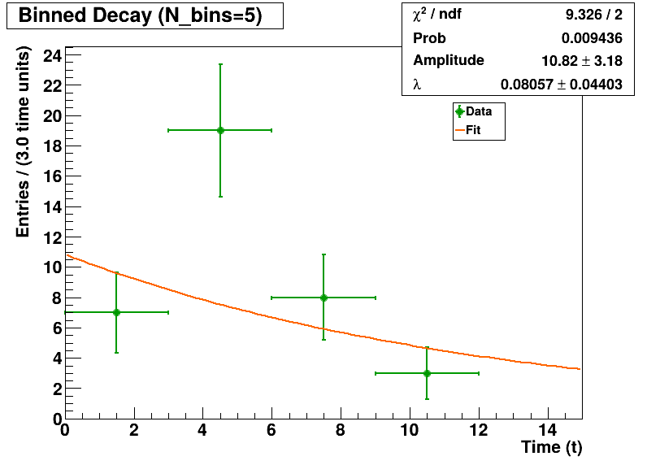
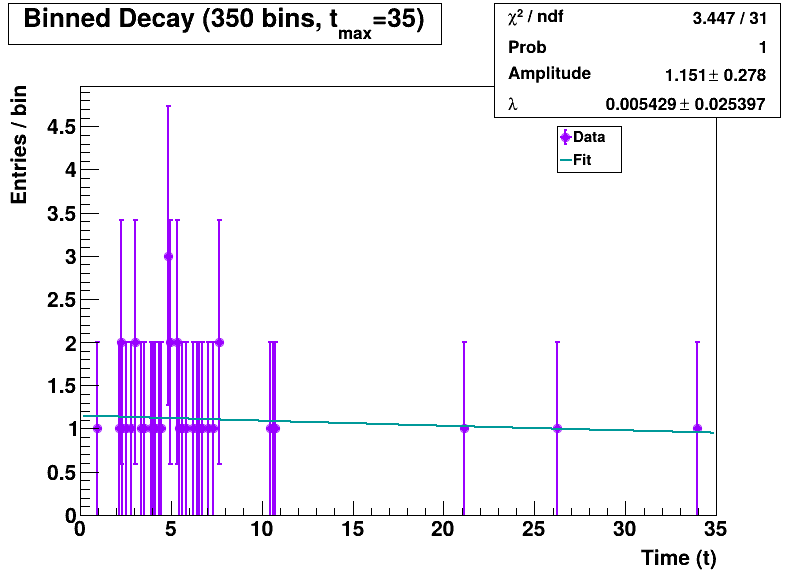

# Maximum Likelihood Data Analysis with ROOT

This repository contains a statistical data analysis project using the ROOT framework for implementing Maximum Likelihood (ML) estimation techniques on different probability distributions.

## Project Structure

The project is organized into multiple parts:

- **Part 1**: Maximum Likelihood estimation for Gaussian distributions, with Monte Carlo error estimation.
- **Part 2**: Implementation of unbinned maximum likelihood estimation and binned fits with various bin counts for exponential decay.
- **Part 3**: Monte Carlo simulations and chi-squared analysis for exponential distributions.

## Part 1: Maximum Likelihood Estimation for Gaussian Distributions

### Assignment Description

> **ROOT Project - part 1**  
> Goal: Illustration of the general idea behind the Maximum Likelihood (ML) estimation method
> 
> * Generate a sample of 50 measurements according to a Gaussian p.d.f. with parameters μ = 0.2 and σ = 0.1.
> * With the obtained data sample, find the ML estimations of the mean and the variance of the parent distribution.
> * Plot the Gaussian distribution using the parameter values for which the likelihood function (and hence also its logarithm) are a maximum. In the same plot, also show the p.d.f. using the true parameter values.
> * Estimate the variance of the mean with the Monte Carlo method. To do this one must simulate a large number of experiments, compute the ML estimates each time and look at how the resulting values are distributed.
>   * Regarding the first Monte Carlo experiment as the 'real' one, simulate 1000 further experiments with 50 measurements each. For the 'true' parameters in the Monte Carlo program, the estimated values from the real experiment can be used.
>   * Plot the histogram of the resulting ML estimates. The sample standard deviation from the 1000 experiments must be calculated from the unbiased estimator of the variance of the p.d.f.
> * Report the statistical error on the mean found from the Monte Carlo method, and compare it with the analytical solution (i.e. σ = σ/√n).

### Implementation Results

#### Gaussian Measurements Sample


#### Gaussian PDF Comparison (ML vs True Parameters)


#### Monte Carlo Distribution of ML Mean Estimates


### Key Findings

- The ML estimate of the mean was found to be close to the true value (estimated: 0.188, true: 0.2)
- The ML estimate of standard deviation was approximately 0.083 (true: 0.1)
- The Monte Carlo error on the mean (0.0116) closely matched the analytical solution (0.0117)
- The ratio of Monte Carlo error to analytical error was 0.991, confirming the theoretical prediction

## Part 2: Unbinned Maximum Likelihood for Exponential Decay

The second part of the project focuses on implementing unbinned maximum likelihood estimation for exponential decay processes and comparing binned fits with various bin counts.

### Implementation Results

#### Binned Fit with 3 Bins


#### Binned Fit with 5 Bins


#### Binned Fit with 350 Bins


#### Log-Likelihood Function


### Key Findings

- Unbinned maximum likelihood provides the most accurate parameter estimates
- Performance degrades with fewer bins in binned analysis
- The log-likelihood function shows a clear maximum at the correct decay parameter

## Technologies Used

- C++ programming language
- ROOT data analysis framework (CERN)
- Statistical analysis techniques (Maximum Likelihood, Chi-squared, Poisson statistics)
- Data visualization

## Getting Started

To run these analyses, you need to have ROOT installed on your system. You can run the macros with:

```bash
root -l ML_Project_Part1.C
root -l ML_Project_Part2.c
```

